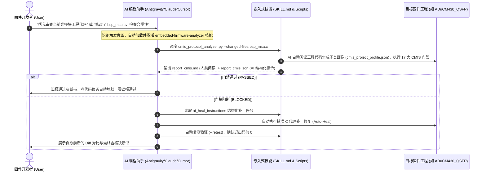
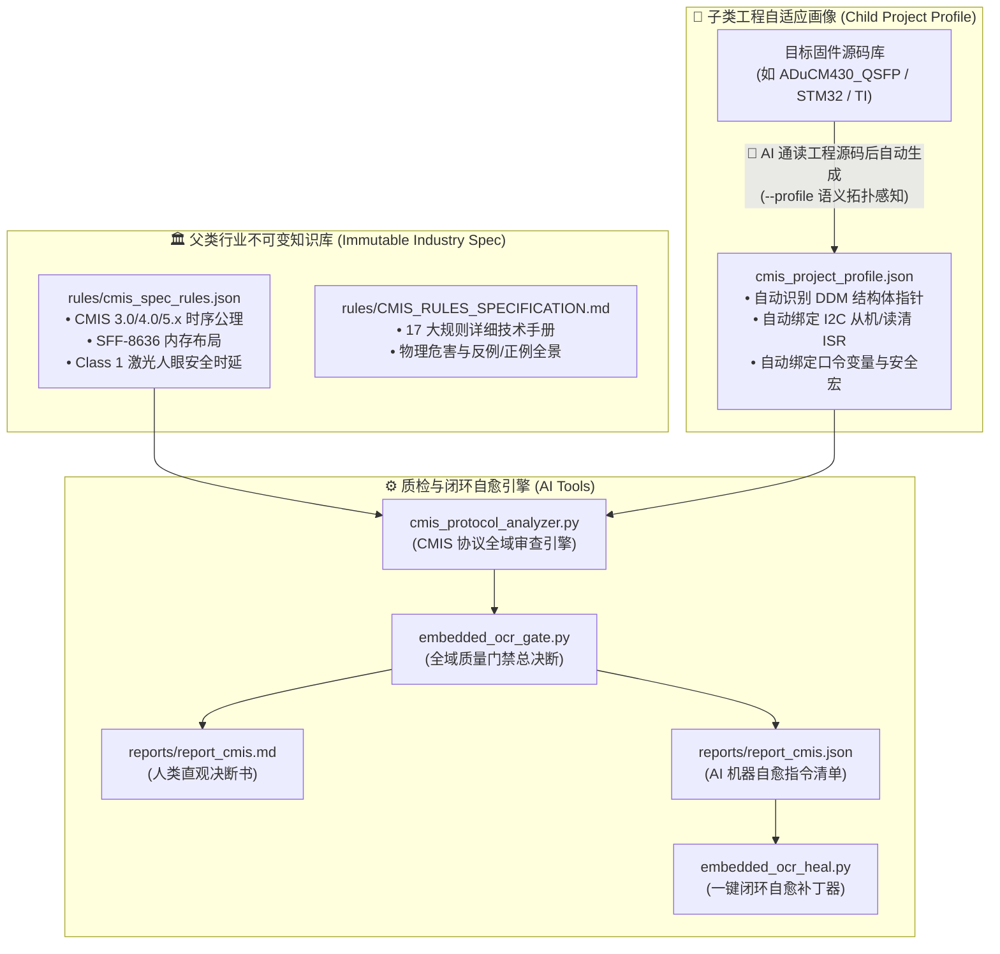

# 📡 embedded-firmware-analyzer
## 专为 AI 编程助手打造的光模块 CMIS 协议与嵌入式固件质量门禁技能插件 (AI Agent Skill)

[](SKILL.md)
[](rules/CMIS_RULES_SPECIFICATION.md)
[](rules/cmis_spec_rules.json)
[-orange.svg)](rules/CMIS_RULES_SPECIFICATION.md#规则-9-激光人眼安全与通道故障强制关断互锁-cmis_tx_fault_interlock_missing)
[](scripts/embedded_ocr_gate.py)
[](README.md)

---

## 🤖 1. 什么是 AI Agent Skill（技能插件）？

`embedded-firmware-analyzer` 是一个专为 **大模型 AI 编程助手（Google Antigravity、Anthropic Claude Code、Cursor、GitHub Copilot、OpenAI Codex 等）** 设计的**垂直领域专业技能插件（Domain-Specific AI Skill）**。

### 为什么 AI 编程助手需要这个 Skill？
- **通用大模型的痛点**：当前通用 AI 编写嵌入式 C/C++ 代码或光模块固件时，缺乏物理硬件意识与专有通信标准常识，极易写出：
  - 16 位 DDM 遥测数据漏做大端反转（导致交换机温度读数错乱上千倍）；
  - I2C 从机中断中执行耗时 Flash 擦写（导致 SCL 严重时钟延展总线死锁）；
  - 锁存告警标志直接裸写覆盖（丢失历史瞬态过温与掉光故障）；
  - 温控 PID 闭环未做增量步进限幅与 DAC 饱和截断（导致激光管热冲击烧毁）；
  - 在线升级引导跳转使用单变量触发（总线毛刺引发在网业务误掉纤）。
- **本 Skill 赋予 AI 的核心能力**：
  - **标准化技能注册 ([`SKILL.md`](SKILL.md))**：提供标准化 frontmatter 元数据与触发词，使 AI 能够根据用户对话自动感知并激活本技能。
  - **Agent 认知心智模型 (Mental Model)**：注入深厚的光通信与 MCU 底层硬件常识，规范 AI 的思考与审查逻辑。
  - **CMIS 17 大黄金防线 ([`rules/cmis_spec_rules.json`](rules/cmis_spec_rules.json))**：行业公理级静态与控制流规则，严格拦截不合规的 AI 生成代码。
  - **AI 闭环自愈闭环 ([`embedded_ocr_heal.py`](scripts/embedded_ocr_heal.py))**：自动产出结构化机器可读的 `ai_heal_instructions`，让 AI 助手能够自主诊断、自动打补丁并自动复测验证！

---

## 🔄 2. AI 智能体如何使用本 Skill？(Workflow)



---

## 🏛️ 3. 核心架构：父子解耦配置体系

本技能采用工业级**父子分层解耦架构**，兼顾行业通用性与私有工程独特性：



1. **父类行业标准库 ([`rules/cmis_spec_rules.json`](rules/cmis_spec_rules.json))**：
   固化 CMIS、SFF、IEEE 国际组织发布的绝对物理时序公理与硬件安全定义。
2. **子类自适应工程画像 (`<workspace>/cmis_project_profile.json`)**：
   > 💡 **特别说明（避免歧义）**：
   > **本子类配置文件是由 AI 编程助手（或分析器 `--profile` 引擎）在阅读目标固件工程源码后全自动分析生成的，开发者完全不需要手动编写或维护！**
   >
   > - **为什么需要子类画像？** 不同厂商/芯片平台的光模块固件（如 ADI ADuCM4x0、ST STM32、Silicon Labs、TI 乃至芯片原厂自研 MCU），其符号命名风格、外设驱动组织与全局状态变量各不相同。
   > - **AI 是如何生成的？** AI 助手接入工程后，自动通读 C 源码与头文件，通过 AST 语义分析与拓扑嗅探，自主生成该工程的专属配置文件：
   >   - 自动识别遥测结构体指针（如 `psDDMTab`、`psTab80`）
   >   - 自动绑定 I2C 从机与读清中断服务函数（如 `bsp_i2cs_rx`、`UpdtIntL`）
   >   - 自动提取特权口令变量与解锁魔数（如 `Psw_Mod`、`PSW_MOD_BOOT`）
   >   - 自动识别大小端翻转宏（如 `SwapU16`、`bsp_swap_u16`）
   >   - 自动锁定总线忙等待与隔离函数（如 `wait_i2c_busy`、`mcu_i2cs_en`）
   > - **零配置适配**：生成子类画像后，父类 17 大 CMIS 行业通用公理即可精准落地到该固件工程中，实现**零人工配置、零误报**的代码门禁审查。

---

## 🛡️ 4. CMIS & 量产鲁棒性 17 大黄金防线矩阵

本 Skill 深度集成 17 条光模块专属防线，涵盖 CMIS 行业通用标准与千万只级量产出货验证的硬件安全实践。详细原理请参阅 [《CMIS 全景规范手册》](rules/CMIS_RULES_SPECIFICATION.md)。

```mermaid
flowchart TD
    subgraph CMIS_SPEC["1. CMIS / SFF 通用标准防线 (Standard CMIS Rules)"]
        direction TB
        R1["[BLOCKER] 16位 DDM 遥测大端翻转防呆 (CMIS_MISSING_ENDIAN_SWAP)"]
        R2["[BLOCKER] I2C ISR 禁阻塞操作 / 时钟延展<=500us (CMIS_I2C_ISR_LONG_LATENCY)"]
        R3["[CRITICAL] 锁存告警按位或累加，禁止直接覆盖 (CMIS_COR_OVERWRITE_HAZARD)"]
        R4["[CRITICAL] 读清处理必须联动刷新 IntL 引脚 (CMIS_COR_MISSING_INTL_UPDATE)"]
        R5["[WARNING] 读清禁止盲写0，需回填瞬时状态 (CMIS_COR_BLIND_ZERO_HAZARD)"]
        R6["[BLOCKER] Page 00h 出厂只读区严禁免密写入 (CMIS_PAGE00_UNLOCKED_WRITE)"]
        R7["[CRITICAL] Byte 127 选页越界安全清洗重置 (CMIS_PAGE_UNCHECKED_BOUNDS)"]
        R8["[CRITICAL] 查表分页 switch 必须安全兜底 (CMIS_PAGE_TABLE_DEFAULT_MISSING)"]
        R9["[CRITICAL] 激光人眼安全与 TxFlt 故障强关互锁 (CMIS_TX_FAULT_INTERLOCK_MISSING)"]
        R10["[CRITICAL] 模块低功耗评估必须软硬双模 OR 判定 (CMIS_LPMODE_OR_LOGIC_DEFECT)"]
        R11["[CRITICAL] CDB 升级触发指令原子置位 Busy (CMIS_CDB_SYNC_STATUS)"]
    end

    subgraph PROD_ROBUSTNESS["2. 量产工程级硬件鲁棒性防御 (Production Robustness Rules)"]
        direction TB
        R12["[CRITICAL] 共享影子区撕裂读保护 wait_i2c_busy (CMIS_I2C_BUSY_GUARD_REQUIRED)"]
        R13["[BLOCKER] Flash 擦写期间必须脱扣 I2C 从机 (EMBEDDED_FLASH_WRITE_I2C_ISOLATION)"]
        R14["[CRITICAL] TEC 温控 PID 增量防饱和与 DAC 双限幅 (EMBEDDED_PID_OUTPUT_CLAMPING)"]
        R15["[CRITICAL] 模拟量校准乘法整型提升与饱和防溢 (EMBEDDED_CALI_INTEGER_PROMOTION)"]
        R16["[WARNING] 动态 LUT 查表温度迟滞防抖与防白片 (EMBEDDED_LUT_MISSING_HYSTERESIS)"]
        R17["[BLOCKER] 在线升级 IAP 跳转双重鉴权防误跳 (EMBEDDED_BOOT_JUMP_SINGLE_LOCK)"]
    end

    CMIS_SPEC --- PROD_ROBUSTNESS
```



### 规则明细速查表

| 规则 ID 与严重级别 | 规范防线 | 违反后的物理危害 | 量产参考实现 (`ADuCM430_QSFP`) |
| :--- | :--- | :--- | :--- |
| **`[BLOCKER] CMIS_MISSING_ENDIAN_SWAP`** | 16位 DDM 遥测大端转换 | 温度/光功率字节颠倒，$+25^\circ\text{C}$ 变成 $+0.098^\circ\text{C}$，交换机误告警并断链 | `SwapU16(stRtDDM.MonTemp)` |
| **`[BLOCKER] CMIS_I2C_ISR_LONG_LATENCY`** | I2C 从机中断耗时禁令 | Clock Stretch 超过 $500\mu s$ 导致交换机报总线挂死并复位接口 | 耗时操作移入后台任务执行 |
| **`[CRITICAL] CMIS_COR_OVERWRITE_HAZARD`** | 锁存告警标志按位或 | 直接覆盖导致瞬间丢失历史过温/掉光（LOS/LOL）故障记录 | `SffLow[bsAddr + i] |= flags[i]` |
| **`[CRITICAL] CMIS_COR_MISSING_INTL_UPDATE`** | 读清联动刷新 `IntL` | 中断引脚永久拉低锁死，交换机陷入无限轮询读取死循环 | 读清后必须调用 `UpdtIntL()` |
| **`[WARNING] CMIS_COR_BLIND_ZERO_HAZARD`** | 读清回填真实状态 | 物理告警仍存时盲目写 0 会引发 `IntL` 毫秒级剧烈振荡（Flapping） | 回填 `g_StatFlgs` 实时状态 |
| **`[BLOCKER] CMIS_PAGE00_UNLOCKED_WRITE`** | Page 00h 出厂区防改 | 主机误写直接篡改光模块 Vendor ID 与出厂校准参数 | 强校验 `Psw_Mod > PSW_MOD_USR1` |
| **`[CRITICAL] CMIS_PAGE_UNCHECKED_BOUNDS`** | Byte 127 选页越界清洗 | 写入未知页号引发物理内存野指针越界，触发 HardFault 死机 | 非法页号安全降级回 `0x00` |
| **`[CRITICAL] CMIS_PAGE_TABLE_DEFAULT_MISSING`**| 查表分页安全兜底 | 读取保留页时吐出 SRAM 脏数据或密码哈希造成信息泄露 | 分发前安全置位 `*p_tdat = 0x00;` |
| **`[CRITICAL] CMIS_TX_FAULT_INTERLOCK_MISSING`**| 激光人眼安全故障强关 | 硬件过流或 Fault 时未关光，损坏光器件并违背人眼安全标准 | `txdis = txdis \| stRtDDM.TxFltFlg;` |
| **`[CRITICAL] CMIS_LPMODE_OR_LOGIC_DEFECT`** | 低功耗评估软硬双模 | 交换机拉高 LPMode 引脚时模块仍在全功率发热，造成板卡跳闸 | `SwLoPwr \|\| (HwLPwrEn && IO_LPWR_IN())` |
| **`[CRITICAL] CMIS_CDB_SYNC_STATUS`** | CDB 命令原子置位 Busy | 状态延迟生效导致主机过早下发后续包，固件升级覆盖变砖 | 接收命令即刻置位 `CdbIsBusy=1` |
| **`[CRITICAL] CMIS_I2C_BUSY_GUARD_REQUIRED`** | 共享影子区撕裂读保护 | 后台大循环写一半、主机读一半，导致交换机读到错乱遥测 | 写入前执行 `wait_i2c_busy();` |
| **`[BLOCKER] EMBEDDED_FLASH_WRITE_I2C_ISOLATION`**| Flash 擦写 I2C 脱扣隔离 | Flash 挂起 CPU 总线几十毫秒，导致 I2C 从机严重超时锁死 | 擦写前后包裹 `mcu_i2cs_en(0/1)` |
| **`[CRITICAL] EMBEDDED_PID_OUTPUT_CLAMPING`** | TEC 温控 PID 双重限幅 | 积分饱和导致温度巨幅过冲，瞬态大电流冲击烧毁 TEC 与激光管 | `HMaxStep` 步进限幅 + `MaxDAC` 截断 |
| **`[CRITICAL] EMBEDDED_CALI_INTEGER_PROMOTION`** | 模拟量校准乘法整型提升 | 16位定点乘法溢出反转，光功率突变负数造成灾难性关光 | 提升为 `int32_t` 并在回转前饱和钳位 |
| **`[WARNING] EMBEDDED_LUT_MISSING_HYSTERESIS`** | 动态 LUT 查表迟滞防抖 | 临界点噪声引发 DAC 高频振荡，严重劣化 400G PAM4 眼图与 TDECQ | $\pm 3^\circ\text{C}$ 迟滞死区 + 非 `0xFFFF` 防白片 |
| **`[BLOCKER] EMBEDDED_BOOT_JUMP_SINGLE_LOCK`** | 升级跳转双重物理鉴权 | 单变量控制极易被单粒子翻转/总线毛刺触发，意外断开光链路 | 必须口令态与魔数令牌（`0xFA`）双重校验 |

---

## 🧰 5. 技能内置工具箱 (9 大分析器 + 1 自愈引擎)

当 AI 助手加载本技能后，可按需自主调度以下独立工具：

| 工具脚本 | 专注领域 | 核心能力 |
| :--- | :--- | :--- |
| **`cmis_protocol_analyzer.py`** | **光模块 CMIS / MSA 协议专属审查** | **父子配置继承 + 控制流/AST 语义感知** |
| `cppcheck_analyzer.py` | 静态代码安全与未定义行为审计 | `cppcheck` XML v2 深度解析 |
| `mem_budget_analyzer.py` | 物理 Flash / SRAM 内存预算与归因 | `pyelftools` + `mapfile-parser` 符号反查 |
| `struct_analyzer.py` | 结构体内存对齐优化与空洞消除 | `pyelftools.dwarf` 逐字节布局重排 |
| `stack_analyzer.py` | 最大调用栈深度与溢出风险推演 | GCC `.su` + DAG / Keil `.htm` 链式分析 |
| `complexity_analyzer.py` | 圈复杂度、Bug 庇护所与超长函数 | `lizard` AST 分析 |
| `concurrency_analyzer.py` | 中断并发竞态与原子性保护 | ISR-to-Task 交叉引用追踪（`volatile` 审查） |
| `polling_timeout_analyzer.py`| 硬件外设死等与防死锁检测 | 寄存器轮询循环超时计数器分析 |
| `float_bloat_analyzer.py` | 软浮点膨胀与显式 double 审查 | 正则与词法 AST 检索 |
| `embedded_ocr_heal.py` | AI 闭环自愈一键打补丁引擎 | 自动化结构化 C 代码修复 |

---

## 🔌 6. 如何在你的 AI 助手 / IDE 中安装和使用？

### 6.1 Google Antigravity 环境
直接克隆或放置到用户全局 Skill 目录或工程 `.agents/skills/` 即可被系统自动发现：
```powershell
# 克隆到 Antigravity 全局 skills 目录
cd C:\Users\<用户名>\.gemini\config\skills\
git clone https://github.com/makemk/embedded-firmware-analyzer.git
```

### 6.2 Claude Code / Cursor / GitHub Copilot 环境
1. 将本仓库克隆至项目本地：
   ```bash
   git submodule add https://github.com/makemk/embedded-firmware-analyzer.git .agents/skills/embedded-firmware-analyzer
   ```
2. 在项目根目录的规则文件（`.cursorrules` 或 `CLAUDE.md`）中引入引用：
   > "请遵循 `.agents/skills/embedded-firmware-analyzer/SKILL.md` 中的规范审查嵌入式与光模块代码。"

### 6.3 本地独立环境初始化 (全隔离 Virtualenv)
```powershell
# Windows
.\setup_env.bat

# Linux / macOS
./setup_env.sh
```

---

## 💻 7. 命令行使用指南 (CLI Commands)

除了供 AI 助手自动调用外，开发者也可以直接在控制台执行命令：

```powershell
# 1. 增量审查（推荐）：仅审查当前修改的文件，自动静默老代码历史债务
& .venv\Scripts\python.exe scripts\cmis_protocol_analyzer.py --workspace "<工程目录>" --changed-files "bsp_msa.c"

# 2. AI 自动阅读工程源码并生成/更新子类画像 Profile（开发者无需手写）：
& .venv\Scripts\python.exe scripts\cmis_protocol_analyzer.py --workspace "<工程目录>" --profile

# 3. 运行全域统一门禁批处理（返回 0 代表通过，1 代表阻断）
.\run_gate.bat --workspace "<工程目录>" --changed-files

# 4. 预览 AI 修复补丁 (Dry-run)
.\run_heal.bat --workspace "<工程目录>"

# 5. 应用修复补丁并自动复测验证闭环 (Apply & Retest)
.\run_heal.bat --workspace "<工程目录>" --apply --retest
```

---

## 📊 8. 人机双模报告机制 (Dual Default Output)

每次执行质检均在目标工程的 `reports/` 目录下同步产出两份报告：

1. **`reports/report_cmis.md` (人类直观决断书)**：
   - 包含高亮警告（GitHub-style Alerts）、违规代码文件精确行号超链接（`file:///...#Lxxx`）。
   - 包含危害说明、推荐正例以及工程 Profile 拓扑全景。
2. **`reports/report_cmis.json` (AI 智能体自愈专享)**：
   - 结构化输出门禁判定（`PASSED` / `BLOCKED`）、退出码、度量数据。
   - 提供精准的 `ai_heal_instructions` 任务清单（文件、行号、修复动作、参数），供 AI 助手直接调用补丁器打补丁。

---

## 📂 9. 目录结构树

```text
embedded-firmware-analyzer/
├── README.md                      # 本手册（说明本 Skill 是面向 AI 助手的质检插件）
├── SKILL.md                       # Antigravity / Agentic AI 技能注册定义与心智模型
├── requirements.txt               # 运行依赖项（pyelftools, lizard 等）
├── setup_env.bat / .sh            # 独立隔离虚拟环境一键构建脚本
├── run_gate.bat                   # 全域统一门禁一键执行入口
├── run_heal.bat                   # 一键闭环自愈执行入口
│
├── rules/                         # 规范与规则知识库
│   ├── cmis_spec_rules.json       # CMIS & 光模块行业标准不可变规则元数据
│   └── CMIS_RULES_SPECIFICATION.md# 17 大 CMIS 黄金防线全景技术解析与反例/正例手册
│
├── scripts/                       # 核心质检与调度引擎 (AI 可执行脚本)
│   ├── cmis_protocol_analyzer.py  # 📡 光模块 CMIS 协议与鲁棒性分析器（核心引擎）
│   ├── embedded_ocr_gate.py       # ⚖️ 全域统一门禁调度器（增量过滤与老代码静默）
│   ├── embedded_ocr_common.py     # 🔧 跨平台作用域判定、Diff 提取与决断构造器
│   ├── embedded_ocr_heal.py       # 🤖 AI 闭环自愈一键补丁引擎
│   ├── cppcheck_analyzer.py       # 静态安全审计
│   ├── mem_budget_analyzer.py     # 物理内存预算
│   ├── struct_analyzer.py         # 结构体空洞与对齐
│   ├── stack_analyzer.py          # 最大栈深推演
│   ├── complexity_analyzer.py     # 圈复杂度
│   ├── concurrency_analyzer.py    # 中断并发与原子性
│   ├── polling_timeout_analyzer.py# 硬件死等与超时
│   └── float_bloat_analyzer.py    # 软浮点膨胀
│
└── tools/                         # 预置绿色工具二进制（cppcheck 等）
```

---

## 📄 10. 开源许可与行业贡献

- 本工程采用 **MIT License**。
- 欢迎光通信模块固件工程师与 AI 智能体开发者共同演进 CMIS 协议库，为高速光电互联构筑坚不可摧的底层安全防线！

