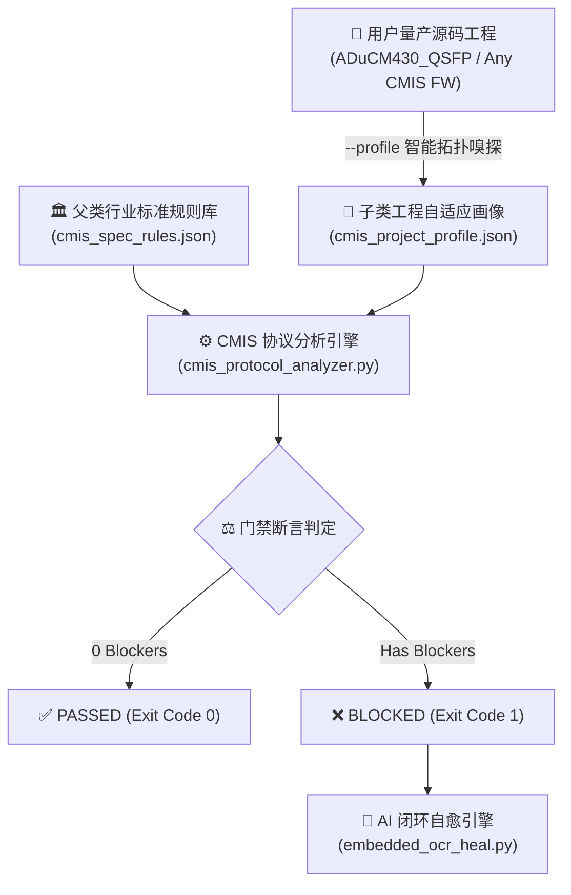

# 📡 光模块 CMIS & 量产鲁棒性协议门禁全景规范详解手册
## Full-Domain CMIS & Production-Grade Transceiver Robustness Specification

> **版本**: `1.0.0`  
> **适用标准**: Common Management Interface Specification (CMIS 3.0 / 4.0 / 5.x), SFF-8636, QSFP-DD / OSFP / QSFP28 MSA, IEEE 802.3  
> **基准实现参考**: `ADuCM430_QSFP` 400G 光模块量产固件工程  
> **执行引擎**: `scripts/cmis_protocol_analyzer.py`  
> **规则源库**: `rules/cmis_spec_rules.json`

---

## 目录
- [一、规范架构与设计哲学](#一规范架构与设计哲学)
- [二、CMIS 行业通用标准防线 (Standard CMIS Rules)](#二cmis-行业通用标准防线-standard-cmis-rules)
  - [规则 1: 16位 DDM 遥测数据大端翻转防呆 (`CMIS_MISSING_ENDIAN_SWAP`)](#规则-1-16位-ddm-遥测数据大端翻转防呆-cmis_missing_endian_swap)
  - [规则 2: I2C 从机中断耗时操作禁令 (`CMIS_I2C_ISR_LONG_LATENCY`)](#规则-2-i2c-从机中断耗时操作禁令-cmis_i2c_isr_long_latency)
  - [规则 3: 锁存告警标志直接覆盖截断 (`CMIS_COR_OVERWRITE_HAZARD`)](#规则-3-锁存告警标志直接覆盖截断-cmis_cor_overwrite_hazard)
  - [规则 4: 读清 (COR) 处理未联动刷新 IntL 硬件中断线 (`CMIS_COR_MISSING_INTL_UPDATE`)](#规则-4-读清-cor-处理未联动刷新-intl-硬件中断线-cmis_cor_missing_intl_update)
  - [规则 5: 读清盲目清零导致中断高频振荡 (`CMIS_COR_BLIND_ZERO_HAZARD`)](#规则-5-读清盲目清零导致中断高频振荡-cmis_cor_blind_zero_hazard)
  - [规则 6: Page 00h 出厂只读区越权写入 (`CMIS_PAGE00_UNLOCKED_WRITE`)](#规则-6-page-00h-出厂只读区越权写入-cmis_page00_unlocked_write)
  - [规则 7: Lower Page Byte 127 选页越界防呆 (`CMIS_PAGE_UNCHECKED_BOUNDS`)](#规则-7-lower-page-byte-127-选页越界防呆-cmis_page_unchecked_bounds)
  - [规则 8: 查表分页缺少安全默认值兜底 (`CMIS_PAGE_TABLE_DEFAULT_MISSING`)](#规则-8-查表分页缺少安全默认值兜底-cmis_page_table_default_missing)
  - [规则 9: 激光人眼安全与通道故障强制关断互锁 (`CMIS_TX_FAULT_INTERLOCK_MISSING`)](#规则-9-激光人眼安全与通道故障强制关断互锁-cmis_tx_fault_interlock_missing)
  - [规则 10: 模块/通道低功耗评估软硬双模“逻辑或”缺陷 (`CMIS_LPMODE_OR_LOGIC_DEFECT`)](#规则-10-模块通道低功耗评估软硬双模逻辑或缺陷-cmis_lpmode_or_logic_defect)
  - [规则 11: CDB 固件升级状态机原子置位与同步性 (`CMIS_CDB_SYNC_STATUS`)](#规则-11-cdb-固件升级状态机原子置位与同步性-cmis_cdb_sync_status)
- [三、量产工程级硬件鲁棒性防御 (Production-Grade Robustness Rules)](#三量产工程级硬件鲁棒性防御-production-grade-robustness-rules)
  - [规则 12: 共享影子寄存器撕裂读保护 (`CMIS_I2C_BUSY_GUARD_REQUIRED`)](#规则-12-共享影子寄存器撕裂读保护-cmis_i2c_busy_guard_required)
  - [规则 13: Flash 擦写 I2C 从机脱扣隔离 (`EMBEDDED_FLASH_WRITE_I2C_ISOLATION`)](#规则-13-flash-擦写-i2c-从机脱扣隔离-embedded_flash_write_i2c_isolation)
  - [规则 14: TEC 温控 PID 积分抗饱和与 DAC 双重限幅 (`EMBEDDED_PID_OUTPUT_CLAMPING`)](#规则-14-tec-温控-pid-积分抗饱和与-dac-双重限幅-embedded_pid_output_clamping)
  - [规则 15: 模拟量校准乘法整型提升与饱和防溢出 (`EMBEDDED_CALI_INTEGER_PROMOTION_AND_SATURATION`)](#规则-15-模拟量校准乘法整型提升与饱和防溢出-embedded_cali_integer_promotion_and_saturation)
  - [规则 16: 动态温度 LUT 查表迟滞防抖与白片防呆 (`EMBEDDED_LUT_MISSING_HYSTERESIS`)](#规则-16-动态温度-lut-查表迟滞防抖与白片防呆-embedded_lut_missing_hysteresis)
  - [规则 17: 在线升级 (IAP) 跳转双重鉴权防误跳 (`EMBEDDED_BOOT_JUMP_SINGLE_LOCK_HAZARD`)](#规则-17-在线升级-iap-跳转双重鉴权防误跳-embedded_boot_jump_single_lock_hazard)
- [四、门禁判决机制与 AI 闭环自愈工作流](#四门禁判决机制与-ai-闭环自愈工作流)

---

## 一、规范架构与设计哲学

光模块（Optical Transceiver）作为现代数据中心与骨干网通信（100G/400G/800G/1.6T）的核心物理互联部件，其固件质量直接决定了整机交换机（如 Cisco、Arista、Huawei 等）的物理链路稳定性。

本规则系统采用 **父子分层配置架构 (Parent-Child Decoupled Configuration)**：
1. **父类不可变行业知识库 ([`rules/cmis_spec_rules.json`](rules/cmis_spec_rules.json))**：固化 CMIS、SFF、IEEE 国际组织发布的绝对物理与时序公理。
2. **子类自适应工程画像 (`<workspace>/cmis_project_profile.json`)**：针对任意厂商 MCU（如 ADI ADuCM4x0、ST STM32、Silicon Labs、TI）动态自动推导指针结构、函数名、宏定义与寄存器映射。



---

## 二、CMIS 行业通用标准防线 (Standard CMIS Rules)

### 规则 1: 16位 DDM 遥测数据大端翻转防呆 (`CMIS_MISSING_ENDIAN_SWAP`)
- **严重级别**: `[BLOCKER]` (最高阻断级)
- **行业规范由来**: 
  - CMIS 4.0 / 5.0 Section 8 以及 SFF-8636 明确规定：所有跨越 2 个字节的 16 位模拟诊断监视数据（DDM/DOM），在 I2C 内存映射中**必须统一采用网络字节序（Big-Endian / MSB First）**存储。
  - 范围涵盖：内部温度（`Temp`）、供电电压（`Vcc`）、各通道激光偏置电流（`TxBias`）、发射光功率（`TxPower` / `TxPo`）、接收光功率（`RxPower` / `RxPo`）。
- **物理危害与约束目的**:
  - 绝大多数嵌入式 MCU（ARM Cortex-M0+/M3/M4/M23/M33、RISC-V）均为原生**小端字节序（Little-Endian）**。
  - 若在将 16 位采集值写入 MSA 共享寄存器前漏做大小端反转，交换机解析得到的高低字节彻底颠倒。例如模块实际温度为 $+25.0^\circ\text{C}$（十六进制 `0x1900`），交换机读取小端存储后解析为 `0x0019`（$+0.098^\circ\text{C}$）或造成千倍级巨大偏差，瞬间触发交换机端口的高温/低温灾难性误报警（Alarm/Warning）并迫使端口断开重连。
- **典型反例 vs 量产正例**:
  ```c
  // ❌ [反例]：直接以 Little-Endian 赋值，写入网络寄存器
  psDDMTab->MonTemp = stRtDDM.MonTemp;
  psQddP11->MonBias[ch] = CaliMonUVal(rawADC, slope, offset);

  // ✅ [量产正例]：显式包裹 SwapU16() 或 __REV16 转换为大端
  // 引用位置：ADuCM430_QSFP/code/app/sys.c
  psDDMTab->MonTemp = SwapU16(stRtDDM.MonTemp);
  psQddP11->MonBias[ch] = SwapU16(stRtDDM.MonBias[ch]);
  ```
- **自愈动作**: `WRAP_ENDIAN_SWAP` —— 自动用项目首选的 `SwapU16(...)` 或 `__REV16(...)` 包裹右值。

---

### 规则 2: I2C 从机中断耗时操作禁令 (`CMIS_I2C_ISR_LONG_LATENCY`)
- **严重级别**: `[BLOCKER]` (最高阻断级)
- **行业规范由来**: 
  - CMIS Section 4.2.1 及 I2C 物理层规范规定：光模块 I2C 从机硬件允许的时钟延展时间（Clock Stretch）**最大上限不得超过 500 微秒 ($\mu s$)**，高频读写建议控制在 $100\mu s$ 以内。
- **物理危害与约束目的**:
  - 严禁在 I2C 接收/发送中断函数（ISR）中执行任何耗时、阻塞或可能引入非确定性延时的操作，包括：Flash 擦除/写入、SPI 外置 Flash 固件升级烧录、`delay_ms()`、`printf()`、动态内存分配 `malloc()` 等。
  - 一旦中断内部被阻塞，硬件将把 SCL 信号线拉低强制让主机等待。当超出交换机的主机 I2C 超时阈值后，交换机 PHY/I2C 控制器将报“Transceiver I2C Bus Hang”，复位总线甚至直接令端口 Down 掉。
- **典型反例 vs 量产正例**:
  ```c
  // ❌ [反例]：在从机接收中断中直接同步执行 Flash 烧写
  void bsp_i2cs_rx(void) {
      if (cmd == CMD_FIRMWARE_BURN) {
          spi_flash_download(pData, len); // 阻塞几十毫秒，致命违规！
      }
  }

  // ✅ [量产正例]：ISR 仅设置任务就绪标志，在主循环或等 STOP 信号后再执行
  void bsp_i2cs_rx(void) {
      if (cmd == CMD_FIRMWARE_BURN) {
          g_CdbTaskPending = 1; // 仅置位标志，立刻退出中断
      }
  }
  ```
- **自愈动作**: `DEFER_I2C_OPERATION` —— 将阻塞操作移至后台任务执行。

---

### 规则 3: 锁存告警标志直接覆盖截断 (`CMIS_COR_OVERWRITE_HAZARD`)
- **严重级别**: `[CRITICAL]` (关键安全级)
- **行业规范由来**: 
  - CMIS Section 8 与 SFF-8636 规定：Page 00h Byte 8~13（模块级告警）与 Page 11h Byte 134~153（通道级告警）定义为**锁存告警标志寄存器 (Latched Flags)**。
- **物理危害与约束目的**:
  - 锁存标志用于记录“自上一次主机读取以来是否发生过瞬态告警”。
  - 必须采用**按位或累加 (`|=`)**更新！如果在后台任务中采用直接赋值 (`=`)，若当前时刻该故障已暂时恢复（瞬态毛刺），直接赋值会瞬间抹除历史发生的告警，导致主机交换机完全丢失模块曾经发生过过温、瞬态掉电或掉光（LOS/LOL）的故障日志，造成不可定位的现场疑难问题。
- **典型反例 vs 量产正例**:
  ```c
  // ❌ [反例]：直接赋值覆盖，丢失历史瞬态告警
  SffLow[bsAddr + i] = g_StatFlgs[i];
  psDDMTab->L_ModFlgs = stRtDDM.ModFlgs;

  // ✅ [量产正例]：按位或累加历史状态
  // 引用位置：ADuCM430_QSFP/code/_BSP/bsp_msa.c:539
  for (uint8_t i = 0; i < 6; i++) {
      SffLow[bsAddr + i] |= g_StatFlgs[i];
  }
  ```
- **自愈动作**: `CONVERT_TO_BITWISE_OR` —— 将赋值符号 `=` 安全转为 `|=`。

---

### 规则 4: 读清 (COR) 处理未联动刷新 IntL 硬件中断线 (`CMIS_COR_MISSING_INTL_UPDATE`)
- **严重级别**: `[CRITICAL]` (关键安全级)
- **行业规范由来**: 
  - CMIS Section 5.3 中断架构规定：光模块通过物理引脚 `IntL`（低电平有效）向交换机通知有未处理的锁存告警。
  - 当主机读取了对应的 Latched Flag 寄存器时（即 Clear-on-Read, COR），如果所有未被屏蔽的告警均已清除，模块必须在 **$200\mu s$ 内释放 `IntL` 硬件引脚（拉高）**。
- **物理危害与约束目的**:
  - 若读清处理函数修改了锁存寄存器，却漏调了 `UpdtIntL()`，会导致硬件 `IntL` 引脚永久锁死在低电平！交换机误认为有海量告警尚未读取，陷入无限轮询读取光模块的死循环，最终判定模块中断失控而触发接口 Flapping。
- **典型反例 vs 量产正例**:
  ```c
  // ❌ [反例]：读清了寄存器，但漏调了中断引脚刷新函数
  void bsp_i2cs_rdc(uint8_t page, uint8_t reg) {
      if (page == 0 && reg == 8) {
          SffLow[8] = g_StatFlgs[0];
          // 漏调了 UpdtIntL()！IntL 引脚将永久锁死在低电平！
      }
  }

  // ✅ [量产正例]：更新锁存后同步调用 UpdtIntL()
  // 引用位置：ADuCM430_QSFP/code/_BSP/bsp_msa.c:1624
  void bsp_i2cs_rdc(uint8_t page, uint8_t reg) {
      if (page == 0 && reg == 8) {
          SffLow[8] = g_StatFlgs[0];
          UpdtIntL(); // 及时释放或重评 IntL 引脚
      }
  }
  ```
- **自愈动作**: `ADD_INTL_UPDATE` —— 在函数返回前自动插入 `UpdtIntL();`。

---

### 规则 5: 读清盲目清零导致中断高频振荡 (`CMIS_COR_BLIND_ZERO_HAZARD`)
- **严重级别**: `[WARNING]` (中度警告级)
- **行业规范由来**: 
  - CMIS Clear-on-Read 核心原则：读清操作清除的是“历史锁存触发态”，但**如果当前物理故障依然处于活跃（Active）状态，寄存器不得清零！**
- **物理危害与约束目的**:
  - 如果执行 `SffLow[8] = 0;` 盲目写 0，而当前模块实际温度依然超过高温停机阈值（Active Alarm 存在），该寄存器将在下一次后台轮询中被重新置 1，并再次拉低 `IntL`。
  - 这会导致 `IntL` 引脚以几毫秒一次的高频剧烈抖动（Flapping），打爆交换机 CPU 的中断处理队列。标准做法是：回填当前实时的状态位（`g_StatFlgs`）。
- **典型反例 vs 量产正例**:
  ```c
  // ❌ [反例]：盲目硬编码写 0
  SffLow[8] = 0x00; 

  // ✅ [量产正例]：回填当前瞬时物理真实状态
  // 引用位置：ADuCM430_QSFP/code/_BSP/bsp_msa.c:1596
  SffLow[i] = g_StatFlgs[i - 8];
  ```
- **自愈动作**: `RESTORE_REALTIME_FLAG` —— 修复为从实时状态缓存恢复。

---

### 规则 6: Page 00h 出厂只读区越权写入 (`CMIS_PAGE00_UNLOCKED_WRITE`)
- **严重级别**: `[BLOCKER]` (最高阻断级)
- **行业规范由来**: 
  - CMIS Section 8 与 SFF-8636：Page 00h Byte 128~255 以及 Lower Page Byte 0~25 为模块的出厂信息区（Vendor Information / Base ID）。
  - 存放关键的厂家名称、PN、SN、IEEE 规范符合性代码及出厂静态校准参数。
- **物理危害与约束目的**:
  - 此区域在光模块出厂后**对主机必须是严格只读的**。
  - 任何针对 Page 00h（`SffT00` / `psIDInfo`）的写操作，必须由厂商口令寄存器（`Psw_Mod > PSW_MOD_USR1`）进行绝对门禁防护！若无口令保护允许任意写入，主机交换机的非法写入或总线噪声将直接窜改光模块 SN 与波长类型，导致整卡识别失败。
- **典型反例 vs 量产正例**:
  ```c
  // ❌ [反例]：无口令校验，直接允许主机写 Page 00h
  if (_page == 0) {
      SffT00[_adr - 128] = _rdat; // 灾难性安全漏洞！
  }

  // ✅ [量产正例]：强口令门禁拦截
  // 引用位置：ADuCM430_QSFP/code/_BSP/bsp_msa.c:1696
  if (psTab80->Psw_Mod > PSW_MOD_USR1) {
      SffT00[_adr - 128] = _rdat;
  }
  ```
- **自愈动作**: `GUARD_PASSWORD_CHECK` —— 增加口令权限条件分支包裹。

---

### 规则 7: Lower Page Byte 127 选页越界防呆 (`CMIS_PAGE_UNCHECKED_BOUNDS`)
- **严重级别**: `[CRITICAL]` (关键安全级)
- **行业规范由来**: 
  - CMIS 内存寻址结构采用“下半页 128 字节固定，上半页 128 字节由 Byte 127 选页寄存器（`TabSel`）动态换页”的分页机制。
- **物理危害与约束目的**:
  - CMIS 规范中合法分页仅包括 Page 00h~04h、10h~14h 及特权厂商页。
  - 当主机向 Byte 127 写入不存在的分页（如写 0x88 或 0xFF）时，若模块未对页号做有效性白名单清洗，后续根据 `TabSel` 计算物理指针偏移量（`p = PageBase + (TabSel * 128)`）时将产生**野指针越界**，引发 MCU 访问未知地址 HardFault 死机。规范要求：写入未知非法页时必须安全清洗归零（降级到 Page 00h）。
- **典型反例 vs 量产正例**:
  ```c
  // ❌ [反例]：直接裸存用户输入的页号
  if (_adr == 127) {
      psDDMTab->TabSel = _rdat;
  }

  // ✅ [量产正例]：默认归零并只允许合法分页写入
  // 引用位置：ADuCM430_QSFP/code/_BSP/bsp_msa.c:1672
  if (_adr == 127) {
      SffLow[_adr] = 0x00; // 默认清零
      if ((_rdat <= 0x04) || (_rdat >= 0x10 && _rdat <= 0x14) || (_rdat >= 0x80)) {
          SffLow[_adr] = _rdat;
      }
  }
  ```
- **自愈动作**: `SANITIZE_PAGE_BOUNDS` —— 添加安全白名单范围校验与默认重置逻辑。

---

### 规则 8: 查表分页缺少安全默认值兜底 (`CMIS_PAGE_TABLE_DEFAULT_MISSING`)
- **严重级别**: `[CRITICAL]` (关键安全级)
- **行业规范由来**: 
  - CMIS Section 8：读取未实现/未初始化的 Upper Page 必须返回全 `0x00`，绝对禁止向主机总线吐出未初始化的随机内存或脏数据。
- **物理危害与约束目的**:
  - 在 I2C 读操作的分页分发 `switch(TabSel)` 语句中，必须在执行分发前预先执行 `*p_tdat = 0x00;` 或在 `default:` 分支中将返回指针置为零值。
  - 避免主机尝试读取保留页时，模块吐出 SRAM 中的密码哈希或堆栈脏数据，造成信息泄露或交换机解析异常。
- **典型反例 vs 量产正例**:
  ```c
  // ❌ [反例]：缺少 default 处理，未匹配的分页返回指针悬空
  switch (TabSel) {
      case 0x00: *p_tdat = SffT00[offset]; break;
      case 0x10: *p_tdat = SffT10[offset]; break;
      // 缺少 default！*p_tdat 维持野值或脏数据
  }

  // ✅ [量产正例]：分发前原子归零
  // 引用位置：ADuCM430_QSFP/code/_BSP/bsp_msa.c:1774
  *p_tdat = 0x00; // 安全兜底
  switch (TabSel) {
      case 0x00: *p_tdat = SffT00[offset]; break;
      case 0x10: *p_tdat = SffT10[offset]; break;
  }
  ```
- **自愈动作**: `ADD_PAGE_SWITCH_DEFAULT` —— 在 `switch` 前或分支内添加安全默认值。

---

### 规则 9: 激光人眼安全与通道故障强制关断互锁 (`CMIS_TX_FAULT_INTERLOCK_MISSING`)
- **严重级别**: `[CRITICAL]` (关键安全级)
- **行业规范由来**: 
  - FDA CDRH 21 CFR 与 IEC 60825-1 (Class 1 Laser Safety)：光模块发射机激光人眼安全强制标准；CMIS Section 5.4 通道级状态机。
- **物理危害与约束目的**:
  - CMIS 寄存器中的 `Tx_Disable` 定义为**高有效（1 = 关断，0 = 发光使能）**。
  - 模块控制逻辑在计算底层 `bsp_tx_dis` 时，**必须强制并入硬件故障标志位（`TxFltFlg`）与硬件 LOS（`TxLosFlg`）！**
  - 如果通道发生过流或驱动失控（`TxFault` 触发），固件必须在 **$100\mu s$ 内强制关断该通道输出**。严禁仅凭主机软件的使能寄存器开光而忽视硬件 Fault 信号，否则会导致激光器过驱烧死甚至破坏人眼安全等级。
- **典型反例 vs 量产正例**:
  ```c
  // ❌ [反例]：仅看主机使能位，缺少硬件 Fault 强行互锁
  uint8_t txdis = psQddP10->TxDis;
  bsp_tx_dis(txdis); // 若发生 TxFault，仍然在出光！

  // ✅ [量产正例]：强制硬件 Fault 强关互锁
  // 引用位置：ADuCM430_QSFP/code/app/sys.c:239
  uint8_t txdis = psQddP10->TxDis;
  txdis = txdis | stRtDDM.TxFltFlg; // 故障必强关！
  bsp_tx_dis(txdis);
  ```
- **自愈动作**: `ADD_TX_FAULT_INTERLOCK` —— 自动并入 `|= stRtDDM.TxFltFlg`。

---

### 规则 10: 模块/通道低功耗评估软硬双模“逻辑或”缺陷 (`CMIS_LPMODE_OR_LOGIC_DEFECT`)
- **严重级别**: `[CRITICAL]` (关键安全级)
- **行业规范由来**: 
  - CMIS Section 5.2 Module State Machine & LPMode 规范：模块供电模式由两部分联合仲裁——**物理管脚 `LPMode`** 与 **CMIS 软件低功耗寄存器 `SwLoPwr`**。
- **物理危害与约束目的**:
  - CMIS 规范公式明确规定：
    $$\text{LowPowerMode} = \text{SwLoPwr} \lor (\text{HwLPwrEn} \land \text{LPMode\_Pin})$$
  - 只要软件置位了 `SwLoPwr`，或者硬件引脚拉高（且未被软件屏蔽），模块就**必须保持在低功耗模式（功率小于 1.5W，禁止 DSP/Laser 全负荷运转）**。若漏掉了硬件引脚评估或漏掉了软件寄存器，当交换机拉高 LPMode 引脚时模块依然狂飚全功率，会造成机框单板供电跳闸或过流保护。
- **典型反例 vs 量产正例**:
  ```c
  // ❌ [反例]：仅读取硬件引脚，忽视软件寄存器
  #define G_LPwrS_R()  IO_LPWR_IN()

  // ✅ [量产正例]：软硬件双模复合评估
  // 引用位置：ADuCM430_QSFP/code/_BSP/MSA_QDD.h:34
  #define G_LPwrS_R() (psDDMTab->ModCtrls.SwLoPwr || (psDDMTab->ModCtrls.HwLPwrEn && IO_LPWR_IN()))
  ```
- **自愈动作**: `FIX_LPMODE_LOGIC` —— 自动替换为完整的双模布尔评估表达式。

---

### 规则 11: CDB 固件升级状态机原子置位与同步性 (`CMIS_CDB_SYNC_STATUS`)
- **严重级别**: `[CRITICAL]` (关键安全级)
- **行业规范由来**: 
  - CMIS Section 7 Command Data Block (CDB)：光模块通用远程固件升级、密码鉴权与脚本下发标准协议。
- **物理危害与约束目的**:
  - 当主机写入 CDB 触发命令（Byte 36 写入 `CmdID`）时，模块必须在当前 I2C 传输周期的 ACK 完成前，**立即原子置位 `CdbIsBusy = 1`（Byte 37 bit 7）**。
  - 严禁将 `CdbIsBusy` 的置位拖延到几十毫秒后的后台大循环中！如果主机在写入后立即读取状态寄存器，读到 `CdbIsBusy == 0`，会误认为命令已经完成，紧接着下发下一个包，导致数据包覆盖丢失，导致在网升级变砖。
- **典型反例 vs 量产正例**:
  ```c
  // ❌ [反例]：命令写入中断中未置位，依赖后台任务置位
  void bsp_i2cs_cdb_write(...) {
      g_CdbCmdReceived = cmd; // 主机立即读 CDBStatus 仍然是 0x00！
  }

  // ✅ [量产正例]：在中断中同步原子置位 Busy
  // 引用位置：ADuCM430_QSFP/code/_BSP/bsp_msa.c:1645
  void bsp_i2cs_cdb_write(...) {
      psDDMTab->CdbStat.CdbIsBusy = 1; // 立即生效
  }
  ```
- **自愈动作**: `ADD_CDB_BUSY_ASSERTION` —— 触发指令即刻置位 `CdbIsBusy`。

---

## 三、量产工程级硬件鲁棒性防御 (Production-Grade Robustness Rules)

> [!NOTE]
> 以下 6 条规则抽象自已在海量数据中心现网稳定运行的成熟光模块量产工程。这些规则不仅是 CMIS 的规范延伸，更是保证单板硬件生命期与 PAM4 物理层极致性能的护城河。

---

### 规则 12: 共享影子寄存器撕裂读保护 (`CMIS_I2C_BUSY_GUARD_REQUIRED`)
- **严重级别**: `[CRITICAL]` (关键安全级)
- **工程实践由来**: 
  - 在光模块多任务架构中，MCU 后台定时主循环负责 ADC 采样并把数据批量同步到 I2C 影子内存区（`SffLow`、`SffT11`），同时调用 `UpdtIntL()`。
  - 与此同时，外部交换机可以随时异步通过 I2C 读取这批数据。
- **物理危害与约束目的**:
  - 若后台更新寄存器时，主机正好处在读取同一地址的双字节中间（如主机刚读完高字节，后台循环立刻更新了低字节），主机将读取到**撕裂错乱的遥测数据（Torn-Read）**。
  - 量产工程的黄金实践：后台循环在批量更新任何 MSA 影子寄存器或更新 `IntL` 前，**必须调用 `wait_i2c_busy()` 轮询等待当前的 I2C 数据帧结束**！
- **典型反例 vs 量产正例**:
  ```c
  // ❌ [反例]：后台循环直接裸写，未做总线忙状态同步
  void bsp_msa_stat(void) {
      for (uint8_t i = 0; i < 6; i++) SffLow[8 + i] |= g_StatFlgs[i]; // 撕裂风险！
      UpdtIntL();
  }

  // ✅ [量产正例]：关键更新前先同步 wait_i2c_busy()
  // 引用位置：ADuCM430_QSFP/code/_BSP/bsp_msa.c:537, 544
  void bsp_msa_stat(void) {
      wait_i2c_busy(); // 等待总线空闲
      for (uint8_t i = 0; i < 6; i++) SffLow[8 + i] |= g_StatFlgs[i];
      wait_i2c_busy(); // 等待总线空闲
      UpdtIntL();
  }
  ```
- **自愈动作**: `ADD_I2C_BUSY_GUARD` —— 在批量更新或调用前插入 `wait_i2c_busy();`。

---

### 规则 13: Flash 擦写 I2C 从机脱扣隔离 (`EMBEDDED_FLASH_WRITE_I2C_ISOLATION`)
- **严重级别**: `[BLOCKER]` (最高阻断级)
- **工程实践由来**: 
  - 嵌入式 MCU 在对内置 Flash 执行扇区擦除（Sector Erase）或字编程（Write Words）期间，其内部 Flash 控制器会挂起 CPU 总线仲裁器，**造成数十毫秒级（20ms~100ms）的硬件停顿**。
- **物理危害与约束目的**:
  - 如果在此期间主机向光模块发送任何 I2C 读写命令，I2C 从机硬件外设无法获得总线响应，直接将 SCL 信号强制拉低。这将造成长达几十毫秒的 Clock Stretch，远远超过 CMIS 规定的 $500\mu s$ 上限，交换机立刻产生致命总线告警甚至复位端口。
  - 量产工程绝对防线：执行 Flash 操作前**必须显式关闭 I2C 从机中断脱扣（`mcu_i2cs_en(0)`）**，使模块在此期间不响应 I2C ACK，迫使主机进行标准的 NACK 重试；Flash 完成并刷新 Cache 后，再重新开启使能（`mcu_i2cs_en(1)`）。
- **典型反例 vs 量产正例**:
  ```c
  // ❌ [反例]：直接裸调 Flash 擦除，未脱扣 I2C 从机
  void app_save_config(uint32_t addr) {
      FlashSectorErase(addr); // 停顿 50ms，I2C 总线必定死锁！
  }

  // ✅ [量产正例]：在 Flash 擦写前后执行完整脱扣与恢复
  // 引用位置：ADuCM430_QSFP/code/_HAL_MCU/mcu.c:564-580
  void mcu_flash_write(uint32_t pg_addr, uint32_t* pBuff, uint32_t len, uint8_t erFlg) {
      mcu_i2cs_en(0); // 1. 脱扣 I2C 从机
      if (erFlg) {
          FlashSectorErase(pg_addr); // 2. 安全擦除
      }
      if (len > 0) {
          CacheDis();
          FlashWriteWords(pg_addr, pBuff, len); // 3. 安全编程
          CacheEn();
      }
      mcu_i2cs_en(1); // 4. 恢复 I2C 从机
  }
  ```
- **自愈动作**: `ISOLATE_FLASH_FROM_I2C` —— 自动包裹 `mcu_i2cs_en(0)` 与 `mcu_i2cs_en(1)`。

---

### 规则 14: TEC 温控 PID 积分抗饱和与 DAC 双重限幅 (`EMBEDDED_PID_OUTPUT_CLAMPING`)
- **严重级别**: `[CRITICAL]` (关键安全级)
- **工程实践由来**: 
  - 高速光模块（如 400G/800G、ZR/ZR+ 相干光模块）的激光器对温度极其敏感（波长温漂系数约为 $0.1\text{ nm}/^\circ\text{C}$）。
  - 热电制冷器（TEC）通过 H 桥电路进行精密闭环温控。
- **物理危害与约束目的**:
  - PID 算法若缺乏增量步进限制与输出饱和限幅：
    1. **积分饱和 (Windup)**：在大温差启动时积分项剧烈累加，引发巨大的温度超调与震荡，导致激光器波长失锁。
    2. **热冲击与硬件烧毁**：单步控制量激增输出过大的电流阶跃，产生机械热应力损坏激光芯片焊点，或导致 H 桥 MOS 管过流烧毁。
  - 必须实施双重限幅：**单步增量限幅 (`HMaxStep`/`CMaxStep`)** + **最终 DAC 输出绝对值限幅 (`MinDAC`/`MaxDAC`)**。
- **典型反例 vs 量产正例**:
  ```c
  // ❌ [反例]：裸 PID 计算，无步进限制与 DAC 限幅
  uint16_t Simple_ATCCalculate(int16_t curTemp, int16_t setTemp, uint16_t oldDAC) {
      int16_t err = setTemp - curTemp;
      int16_t res = P * err + I * sumErr;
      return (oldDAC + res); // 极端情况下输出 0xFFFF 烧毁 TEC！
  }

  // ✅ [量产正例]：严谨的防积分饱和双重限幅
  // 引用位置：ADuCM430_QSFP/code/_BSP/tec.c:27-44
  g_psTecCfg->Result = ...;
  // 1. 单步变化增量限制
  if (g_psTecCfg->Result > g_psTecCfg->HMaxStep) g_psTecCfg->Result = g_psTecCfg->HMaxStep;
  if (g_psTecCfg->Result < g_psTecCfg->CMaxStep) g_psTecCfg->Result = g_psTecCfg->CMaxStep;

  wDacVal = (uint16_t)(oldDAC + g_psTecCfg->Result);
  // 2. 最终输出绝对安全值饱和钳位
  if (wDacVal > SwapU16(g_psTecCfg->MaxDAC)) wDacVal = SwapU16(g_psTecCfg->MaxDAC);
  else if (wDacVal < SwapU16(g_psTecCfg->MinDAC)) wDacVal = SwapU16(g_psTecCfg->MinDAC);
  return wDacVal;
  ```
- **自愈动作**: `ADD_PID_CLAMPING` —— 自动引入单步增量限制与极值裁剪结构。

---

### 规则 15: 模拟量校准乘法整型提升与饱和防溢出 (`EMBEDDED_CALI_INTEGER_PROMOTION_AND_SATURATION`)
- **严重级别**: `[CRITICAL]` (关键安全级)
- **工程实践由来**: 
  - 光模块的内部电压、温度、光功率均采用定点线性校准公式：
    $$\text{Target} = \frac{\text{ADC\_Val} \times \text{Slope}}{256} + \text{Offset}$$
- **物理危害与约束目的**:
  - `sADCVal`（16 位有符号）与 `slope`（16 位无符号）相乘时，若直接以 16 位整数计算，在正常信号输入下乘积立刻超出 $\pm 32767$，产生**严重整型乘法溢出**！
  - 加上 `offset` 后，若不进行 `INT16_MAX` / `INT16_MIN` 饱和截断，一旦发生溢出回转，正值（如 $+32768$）将瞬间反转为负值（$-32768$），造成交换机采集到的光功率突变为负无穷大，触发灾难性误关断。
- **典型反例 vs 量产正例**:
  ```c
  // ❌ [反例]：未做 32 位整型提升，无截断直接强转
  int16_t CaliMonSVal(int16_t sADCVal, uint16_t slope, int16_t offset) {
      return (int16_t)((sADCVal * slope >> 8) + offset); // 乘法立刻溢出回转！
  }

  // ✅ [量产正例]：提升为 int32_t 运算，回转前进行上下限饱和钳位
  // 引用位置：ADuCM430_QSFP/code/_BSP/bsp_msa.c:1877-1887
  int16_t CaliMonSVal(int16_t sADCVal, uint16_t slope, int16_t offset) {
      int32_t lADCVal = sADCVal;
      lADCVal = lADCVal * slope; // 32 位整型提升
      lADCVal = (lADCVal >> 8) + offset;
      // 上下限饱和防溢出
      if (lADCVal > INT16_MAX)      lADCVal = INT16_MAX;
      else if (lADCVal < INT16_MIN) lADCVal = INT16_MIN;
      return (int16_t)lADCVal;
  }
  ```
- **自愈动作**: `ADD_CALI_SATURATION` —— 自动重构为 `int32_t` 中间变量并插入 `INT16_MAX/MIN` 钳位。

---

### 规则 16: 动态温度 LUT 查表迟滞防抖与白片防呆 (`EMBEDDED_LUT_MISSING_HYSTERESIS`)
- **严重级别**: `[WARNING]` (中度警告级)
- **工程实践由来**: 
  - 光模块的激光器偏置电流（Bias）与调制深度（Modulation）随温度变化呈现非线性衰减，通常在 Flash 中烧录了一张以温度为索引的查找表（Look-Up Table, LUT）。
- **物理危害与约束目的**:
  - **迟滞防抖 (Hysteresis)**：如果算法在每个温度采样周期都重新查表更新 DAC，当环境温度稳定在临界跳变点（例如 $45.0^\circ\text{C} \leftrightarrow 45.1^\circ\text{C}$）时，ADC 的微小噪声会导致输出 DAC 发生高频振荡，直接劣化 400G PAM4 信号的眼图质量与 TDECQ。必须设置 $\pm 3^\circ\text{C}$ 的迟滞死区。
  - **白片防呆 (Blank Flash Guard)**：若模块进入未校准的温度区间或 Flash 扇区被意外擦除（内容为 `0xFFFF`），未校验直接打出 `0xFFFF` 的 DAC 值会导致激光管超负荷烧毁！
- **典型反例 vs 量产正例**:
  ```c
  // ❌ [反例]：裸算索引，无温度死区滤波，无白片校验
  void bsp_lut_comp(int16_t temp) {
      uint16_t idx = temp / 3;
      uint16_t dac = FlashLUT[idx];
      SetDAC(dac); // 临界点高频抖动，且遇 0xFFFF 直接烧管！
  }

  // ✅ [量产正例]：温度区间钳位 + 3度死区滤波 + 0xFFFF 白片防呆
  // 引用位置：ADuCM430_QSFP/code/_BSP/bsp_msa.c:436-470
  // 1. 输入温度钳位
  if (temp > 0x9F00) temp = 0x9F00;
  else if (temp < 0) temp = 0x0000;

  // 2. 3度死区迟滞滤波 (只在超出死区时才重新计算索引)
  hi = (wOld > 0x9C00) ? 0x9F00 : wOld + 0x300;
  lo = (wOld < 0x0300) ? 0x0000 : wOld - 0x300;
  if ((wVal <= lo) || (wVal >= hi)) {
      idx = (wVal >> 8) / 3;
  }

  // 3. Flash 白片校验
  if (wVal != 0xFFFF) {
      SetDAC(wVal);
  }
  ```
- **自愈动作**: `ADD_LUT_HYSTERESIS` —— 引入输入保护与迟滞死区判定。

---

### 规则 17: 在线升级 (IAP) 跳转双重鉴权防误跳 (`EMBEDDED_BOOT_JUMP_SINGLE_LOCK_HAZARD`)
- **严重级别**: `[BLOCKER]` (最高阻断级)
- **工程实践由来**: 
  - 光模块支持在线固件更新（In-Application Programming, IAP）。当模块跳转至 Bootloader 时，业务通信中断，甚至执行整片擦除。
- **物理危害与约束目的**:
  - 如果跳转条件**仅依赖单一变量或单个命令寄存器**（如 `if (psDDMTab->BankSel == 0xFA) mcu_startboot();`）：
  - 当现场遇到电源波动、EMC 瞬态静电干扰、宇宙射线单粒子翻转（Bit Flip），或主机因总线冲突意外发送了脏数据时，模块极其容易发生**意外误跳入 Bootloader**，瞬间掐断整个数据中心交换机正在承载的核心骨干业务！
  - 严谨的量产工程要求**双重甚至多重完全独立的物理与逻辑条件联锁**：必须同时验证“厂商特权口令已解锁（`PSW_MOD_BOOT`）”与“特定选页寄存器魔数（`BankSel == 0xFA`）”。
- **典型反例 vs 量产正例**:
  ```c
  // ❌ [反例]：单变量弱校验，极易误触发
  void bsp_boot_jump(void) {
      if (psDDMTab->BankSel == 0xFA) { // 仅凭一个字节就跳 Boot！
          mcu_startboot(0xfffe);
      }
  }

  // ✅ [量产正例]：特权口令 + 魔数令牌双重物理联锁
  // 引用位置：ADuCM430_QSFP/code/_BSP/bsp_msa.c:1501
  void bsp_boot_jump(void) {
      if ((psTab80->Psw_Mod == PSW_MOD_BOOT) && (psDDMTab->BankSel == 0xFA)) {
          mcu_startboot(0xfffe); // 绝对安全！
      }
  }
  ```
- **自愈动作**: `REQUIRE_DUAL_BOOT_INTERLOCK` —— 强制改写为特权口令态与魔数令牌的双重判定。

---

## 四、门禁判决机制与 AI 闭环自愈工作流

### 1. 门禁判决逻辑 (Gate Decision Matrix)

每个分析器统一向全域门禁调度器输出结构化决断：
- **`BLOCKED` (退出码 1)**：新增代码中存在任何一条 `[BLOCKER]` 或 `[CRITICAL]` 级别违规，门禁立即熔断，阻止代码合入。
- **`PASSED` (退出码 0)**：改动范围代码完全合规，历史代码遗留违规自动标记为 `legacy_suppressed`，保持开发高效流转。

### 2. 人机双模报告机制 (Dual Default Output)
在每次执行分析或门禁审查后，系统自动在 `reports/` 目录同步生成两份报告：
1. **`report_cmis.md`**：面向工程师的 Markdown 决断书，包含高亮报警、文件跳转锚点链接（`file:///...#Lxxx`）与修复指引。
2. **`report_cmis.json`**：面向 AI 与流水线的机器可读文件，包含 `ai_heal_instructions` 任务清单（精确到行号、动作名与修复参数）。

### 3. 一键自愈验证命令 (Auto-Heal & Verify)
```bash
# 1. 执行增量审查
python scripts/cmis_protocol_analyzer.py --workspace <WORKSPACE> --changed-files <FILE>

# 2. 预览 AI 修复补丁 (Dry-Run)
python scripts/embedded_ocr_heal.py --workspace <WORKSPACE>

# 3. 应用补丁并自动复测验证闭环 (Apply & Retest)
python scripts/embedded_ocr_heal.py --workspace <WORKSPACE> --apply --retest
```

